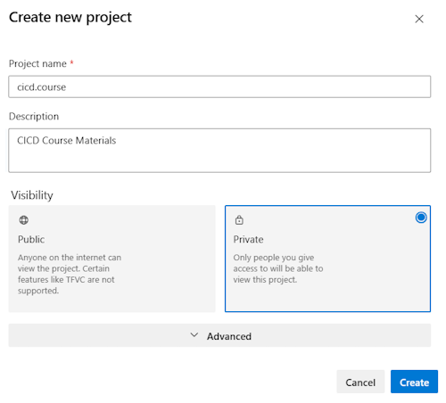
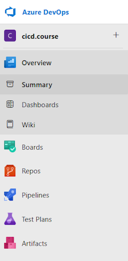

# Before you start

## What is needed?

* Azure DevOps Organization
* Azure Subscription

## Prepare your Azure DevOps (ADO) Organization

### Create a new ADO Organization

Goto [dev.azure.com](http://dev.azure.com) and sign in with your credentials. If you don't already have a DevOps organization you can use for testing create a "New organization" by clicking on "New organization" link on the lower left side of the page.

Now we have a new Organization in Azure DevOps and we can continue with creating a new project.

### Create a new ADO Project

Within your new ADO organization you can create one or more Projects.

Projects can have different levels of visibility:

* Public - Anyone on the internet can view the project.
* Enterprise - Member of your enterprise can view the project.
* Private - Only people you give access to will be able to view this project.

For this training specify a name, select "Private" and click on "+ Create project".

After a few seconds you should see your new project in Azure DevOps:

We are now done with the preparation for our lab.

<!-- ------------------------------------------------------------------------------------------ -->
---

[Begin First Lab](/Labs/lab1/lab1.md) | [Create a Custom Build Agent](/Labs/Build-Agents/desktop-runner/README.md) | [VS Code Install](/Labs/lab0/Visual-Studio-Code.md) | [Table of Contents](/README.md)
