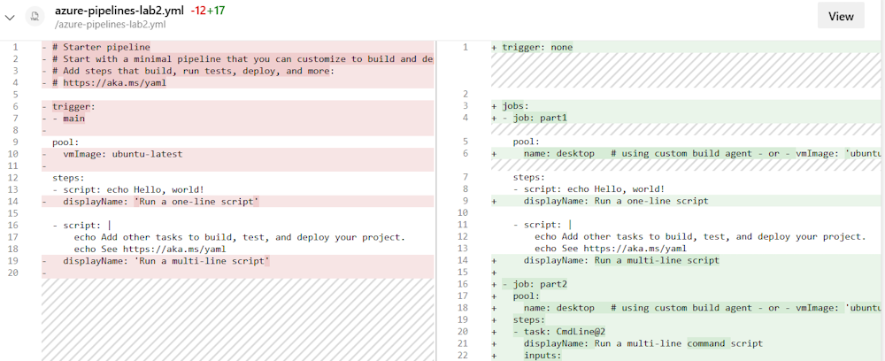
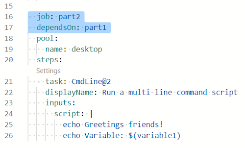

# Lab 2 - Tasks, Jobs, Stages and Dependencies

In [Lab 1](../lab1/lab1.md) we have learned how to build a simple pipeline using Azure DevOps. In this lab we are going a bit deeper working with more advanced functionality.

In case you have not finished [Lab 1](../lab1/lab1.md), please go back and finish it first.

Exercises:

* [2.1 Separating Tasks into Jobs](#exercise-21-separating-tasks-into-jobs)
* [2.2 Adding Dependencies between Jobs](#exercise-22-adding-dependencies-between-jobs)
* [2.3 Splitting the Pipeline into Stages](#exercise-23-splitting-the-pipeline-into-stages)
* [2.4 Adding Dependencies between Stages](#exercise-24-adding-dependencies-between-stages)
* [2.5 Approvals](#exercise-25-approvals)

---

## Exercise 2.1: Separating Tasks into Jobs

At the end of [Lab 1](../lab1/lab1.md), our pipeline had three steps. All of them were executed in a single job. But what is a job?

> **What is a job?**  
> You can organize your pipeline into jobs. Every pipeline has at least one job. A job is a series of steps that run sequentially as a unit. In other words, a job is the smallest unit of work that can be scheduled to run.  
> See [docs.microsoft.com](https://docs.microsoft.com/azure/devops/pipelines/process/phases?view=azure-devops&tabs=yaml) for more information.

In our previous lab we have created a pipeline using the wizard. The wizard creates a pipeline with a single job, like this:

```yml
pool:
  vmImage: 'ubuntu-latest'
steps:
- bash: echo "Hello world"
```

This example shows a single job, using Ubuntu 22.04 (Microsoft-hosted agent), containing a single task "bash". We now want to split our previously created pipeline into two jobs.

* Goto Pipelines -> Pipelines, select our pipeline, and click `Edit`

We now want to separate the last task into a separate job. To achieve this we're now replacing the existing pipeline with the following one:

```yml
trigger: none

jobs:
- job: part1
  pool:
  name: default                # if using custom build agent
  # vmImage: 'ubuntu-latest'   # if using Microsoft-hosted agents
  steps:
  - script: echo Hello, world!
    displayName: 'Run a one-line script'

  - script: |
      echo Add other tasks to build, test, and deploy your project.
      echo See https://aka.ms/yaml
    displayName: 'Run a multi-line script'

- job: part2
  pool:
  name: default                # if using custom build agent
  # vmImage: 'ubuntu-latest'   # if using Microsoft-hosted agents
  steps:
  - task: Bash@3
    inputs:
      targetType: 'inline'
      script: |
        # Write your commands here
        echo 'Greetings friends!'
        echo 'Variable: $(variable1)'
```

* Click on `Save`
* Select `Create a new branch for this commit`
* Call it `addedjobs`


* Select `Start a pull request`
* Click `Save`

This will now save our changes in a separate branch and create a pull request. That allows us to review our changes.

* Goto `Repos`
* Click `Pull requests` (make sure that you're in the correct repo)
* Select the pull request in `Created by me`


* Click on `Files`

This will now show us the difference between the previous and the modified pipeline:



To complete the PR and merge our changes into main you can now click `Complete` And click `Complete merge`.

The default setting is to delete your newly created branch after merging. Leave it as it is.


Merging our PR will **not** automatically start a new pipeline run as we set our trigger to _none_.

Let us start (by clicking `Run New`) the pipeline manually and take a look:

* Click Pipelines -> Pipelines, select our pipeline, select the last run

And here you will already see that our pipeline is now split into two different jobs:


As we have not specified any dependencies our two jobs can run in parallel and without a specific order. In aboves screenshot part2 is already finished while part1 was not even started.

When you click on one of the jobs, you can see more details about the steps and tasks within each of your jobs:


Jobs are a great feature to run tasks in parallel, in a specific order or on different platforms (Windows, Linux, etc.).

Before we now proceed with the next task, let us add a dependency to make sure that part1 is executed before part2 in our pipeline.

<!-- ------------------------------------------------------------------------------------------ -->
---

## Exercise 2.2: Adding Dependencies between Jobs

Let us now go back to our pipeline and add a dependency:

1. Goto Pipelines -> Pipelines, select our pipeline, and click `Edit`
1. Add a new line after `- job: part2` (the line number might vary)

  ```yml
  - job: part2
    dependsOn: part1
  ```

  > Make sure that dependsOn is aligned with job.

  

1. Click `Save`, default to `Commit directly to the main branch`, and click `Save`

As we have set the trigger to none, this will not trigger our pipeline automatically anymore.

Click on `Run`, default to selecting the "main" branch, then click `Run`.  This will trigger a new run of our pipeline.

1. Goto Pipelines -> Pipelines, select our pipeline, and select the last run

Now you will see that part1 will be executed first and part2 will start after part1 was successfully finished.

  

<!-- ------------------------------------------------------------------------------------------ -->
---

## Exercise 2.3: Splitting the Pipeline into Stages

Now that we had a quick intro into jobs we'll now continue with stages.

> **What are stages?**  
> You can organize the jobs in your pipeline into stages. Stages are the major divisions in a pipeline: "build this app", "run these tests", and "deploy to pre-production" are good examples of stages. They are a logical boundary in your pipeline at which you can pause the pipeline and perform various checks.  
> Every pipeline has at least one stage even if you do not explicitly define it. Stages may be arranged into a dependency graph: "run this stage before that one".  
> Goto [docs.microsoft.com](https://docs.microsoft.com/azure/devops/pipelines/process/stages) to learn more.

A stage can contain one or more jobs. Here is an example how this could look like:

```yml
stages:
- stage: A
  jobs:
  - job: A1
  - job: A2

- stage: B
  jobs:
  - job: B1
  - job: B2
```

Let's now implement stages in our pipeline.

* Goto Pipelines -> Pipelines, select our pipeline, then click `Edit`

Replace the entire pipeline with the following code:

```yml
trigger: none

stages:
- stage: stage1
  jobs:
  - job: stage1part1
    pool:
      name: default                # if using custom build agent
      # vmImage: 'ubuntu-latest'   # if using Microsoft-hosted agents
    steps:
    - script: echo Hello, world!
      displayName: 'Run a one-line script'
  - job: stage1part2
    pool:
      name: default                # if using custom build agent
      # vmImage: 'ubuntu-latest'   # if using Microsoft-hosted agents
      steps:
      - script: |
          echo Add other tasks to build, test, and deploy your project.
          echo See https://aka.ms/yaml
        displayName: 'Run a multi-line script'

- stage: stage2
  jobs:
  - job: stage2part1
    pool:
      name: default                # if using custom build agent
      # vmImage: 'ubuntu-latest'   # if using Microsoft-hosted agents
    steps:
    - task: Bash@3
      inputs:
        targetType: 'inline'
        script: |
          # Write your commands here
          echo 'Greetings from Seattle!'
          echo 'Variable: $(variable1)'
```

* Click `Save`, default to  `Commit directly to the main branch`, and click `Save`

Since we set the trigger to _none_, this will not trigger our pipeline automatically anymore.

* Click on `Run`, default to select the "main" branch, then click `Run`

You will directly see the first difference. Our pipeline has now two stages:


The result will look like this:


We now have a pipeline that contains two stages:

* Stage 1
* Stage 2

And both stages contain one or more jobs. But there are no dependencies between our jobs and stages. Our jobs can run in parallel and without a specific order and the stages will be executed based on the order they're defined in the YML file.Go to [docs.microsoft.com](https://docs.microsoft.com/azure/devops/pipelines/process/stages) to learn more about stages.

In our next task we're going to add dependencies to our stages.

<!-- ------------------------------------------------------------------------------------------ -->
---

## Exercise 2.4: Adding Dependencies between Stages

In our previous task we have mentioned that stages will by default be executed in the order they are defined in the YML file, but there are more ways to control their behavior. In this task we are going to add dependencies to our stages.

Let's go back to our pipeline:

* Goto Pipelines -> Pipelines, select our pipeline, and click `Edit`
* Search for `- stage: stage2`
* Add a `dependsOn`

> Make sure that dependsOn is aligned with job.

```yml
- stage: stage2
  dependsOn: stage1
  jobs:
```

This will define what is already defined due to the order of our stages. Stage2 will now depend on Stage1 and will not be executed before Stage1 was successfully finished.

To make it a bit more interesting, let us now add a third stage that depends on Stage2.

* Goto the end of our pipeline
* Add the following code

```yml
- stage: stage3
  dependsOn: stage2
  jobs:
  - job: stage3job1
```

And let's also add a forth stage that depends on stage1:

```yml
- stage: stage4
  dependsOn: stage1
  jobs:
  - job: stage4job1
```

* Click `Save`, default to `Commit directly to the main branch`, and click `Save`
* Click on `Run`, default to the "main" branch, and click on `Run`

Our pipeline looks slightly different now:


As you can see in our example, our pipelines can become as complex as you want. In case simple dependencies are not enough there are also other options to run stages in parallel or to depend on multiple stages.

If you want to run a stage in parallel you can specify this directly:

```yml
- stage: TestStage
  dependsOn: []    # this removes the implicit dependency on previous stage and causes this to run in parallel
  jobs:
  - job:
    ...
```

If you want your pipeline to depend on multiple stages, you can specify them as a list:

```yml
- stage: DeployEurope
  dependsOn:         # this stage runs after DeployUS1 and DeployUS2
  - DeployUS1
  - DeployUS2
```

Let us do a last change in our pipeline to close the loop and to bring the stages back together as part of an additional, last stage:

* Goto Pipelines -> Pipelines, select our pipeline, and click `Edit`
* Goto the end of our pipeline, and add the following code

```yml
- stage: stage5
  dependsOn:
  - stage4
  - stage3
  jobs:
  - job: stage5job1
```

* Click `Save`, default to `Commit directly to the main branch`, and click `Save`
* Click on `Run`, default to the "main" branch, and click on `Run`


Our last stage **stage5** will be executed after **stage3** and **stage4** were executed successfully.

You can also see the jobs to stage correlation including time take for each job to complete by clicking on **Jobs** as show below.


<!-- ------------------------------------------------------------------------------------------ -->
---

## Exercise 2.5: Approvals

There are several scenarios where an additional approval is needed before a deployment into a specific stage or environment can be started. In this task we'll extend our pipeline to require a manual approval before stage 5 will be executed.

* Goto Pipelines -> Pipelines, select our pipeline, and click `Edit`

To define approvals we've to introduce environments first. Environments are additional properties that are only available in deployment jobs.

> **Environments**  
> The environment keyword specifies the environment or its resource that is targeted by a deployment job of the pipeline. An environment also holds information about the deployment strategy for running the steps defined inside the job. Goto [docs.microsoft.com](https://docs.microsoft.com/azure/devops/pipelines/yaml-schema?view=azure-devops&tabs=schema#environment) for more information.

Currently our Stage 5 looks like this:


Let's now modify Stage 5 to look like this:


Here's the code:

```yml
- stage: stage5
  dependsOn:
  - stage4
  - stage3
  jobs:
  - deployment: stage5job1
    environment: production
```

* Click `Save`, default to `Commit directly to the main branch`, and click `Save`
* Click on `Run`, default to the "main" branch, and click on `Run`

A few minutes later, all our stages are completed.


But where's our approval? What happened in the background is that Azure DevOps has now created the environment `production`. As defined in our deployment job **stage5job1**.

* Goto Pipelines -> Environments

You should see the new environment **production**.


* Click on environment `production`
* Click on `Approvals and checks` tab and click on the `+` sign to add your first check:


* Select `Approvals` from the list that pops up and enter the details:


* Select yourself as `Approver` (in real world deployments you'll probably use a group)
* (optional) Insert some instructions
* Click on `Create`

Let's now go back to our pipeline to check if it now requires an additional approval.

* Goto Pipelines -> Pipelines, select our pipeline, and click "Run pipeline" then click `Run`

After finishing all previous stages, you should see that stage5 is now in "Waiting" state, waiting for an approval.


* Click `Review`
* Click `Reject` or `Approve`

<!-- ------------------------------------------------------------------------------------------ -->
---

This completes Lab 2.

[Next Lab](../lab3/lab3.md) | [Previous Lab](../lab1/lab1.md) | [Table of Contents](/README.md)
