# Lab 3 - Working with (YAML) Templates

In this lab we are now going to take a deeper look into one of the powerful features of YAML-based pipelines in Azure DevOps. We are going to work with YML Templates. So first of all let us start with a question:

**Why do I need templates and why should I use them?**

The short answer is YAML-based or pipelines in general can quickly get very long and complex. There are often times situations where you are doing things multiple times (stages for example), and to avoid duplicating code over and over again we can use templates to make parts of our pipeline re-usable.

> Azure Pipelines supports these four kinds of templates: **Stage**, **Job**, **Step** and **Variable**. Templates themselves can include other templates. Azure Pipelines supports a maximum of 50 unique template files in a single pipeline.  
> Go to [docs.microsoft.com](https://docs.microsoft.com/azure/devops/pipelines/yaml-schema?view=azure-devops&tabs=schema#template-references) to learn more.

Exercises:

* [3.1 Load Steps from Templates](#exercise-31-load-steps-from-templates)
* [3.2 Reusing Templates in Different Stages](#exercise-32-reusing-templates-in-different-stages)
* [3.3 Conditions](#exercise-33-conditions)
* [3.4 Skipping Stages](#exercise-34-skipping-stages)

<!-- ------------------------------------------------------------------------------------------ -->
---

## Exercise 3.1: Load Steps from Templates

Let us start with a basic example. We want to extend a new pipeline, like the one we created in [Lab 1](../lab1/lab1.md) and [Lab 2](../lab2/lab2.md), with its **steps** stored in a **template**.  This is one of the most important concepts to main as it will enable you to create repeatable and reusable patterns that can be used across multiple pipelines.

> **Important!** Make sure that you have, as part of [Lab 1](../lab1/lab1.md#11-create-a-yaml-pipeline-via-gui), imported our GitHub repository into your Azure DevOps project.

Let us start..

* Goto Pipelines -> Pipelines
* Click `New pipeline`
* Select `Azure Repos Git (YAML)`
* Select our repository
* Click `Starter pipeline`

This will now create new new `Starter pipeline` in our repository.

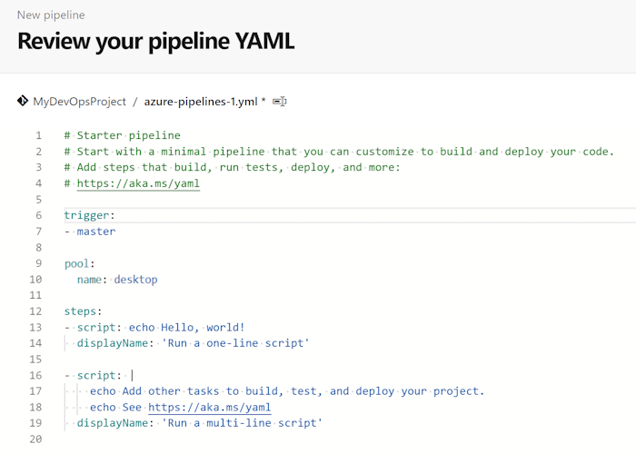

Let us give our new pipeline a name that is a bit better than the default azure-pipelines-1-yml.

* Click on the filename

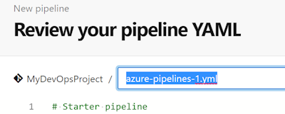

Let us use `starter-pipeline-with-template.yml`.

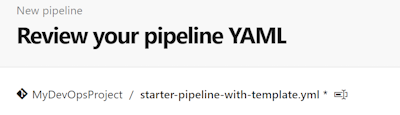

Now that we have created a new pipeline and renamed it successfully, let us now reference to a template that contains our additional steps/tasks.

To achieve this we can now add the following line to the end of our pipeline:

```yml
- template: /.azdo/pipelines/templates/cowsay-template.yml
```

After adding this line to the end of our new pipeline:

* Click `Save and run`
* Select `Create a new branch for this commit`
* Call it `lab3`
* Click `Save and run`

Our new pipeline looks pretty similar to what we did in the previous labs, with the difference that we are now referencing to another file that contains additional parts used by our pipeline:

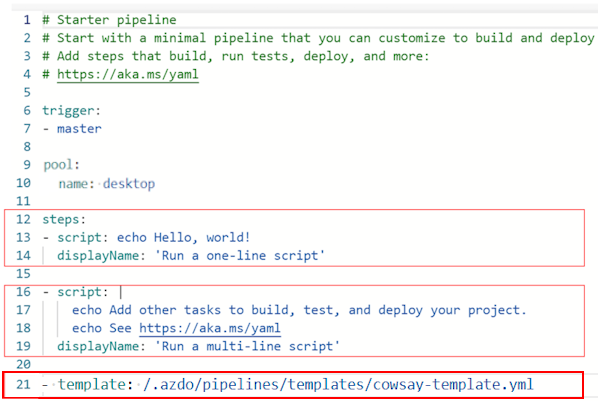

In aboves screenshot you can now see three blocks, the first two steps (13-14 and 16-19) from the starter pipeline example and the last one (line 21) that is loading our template.

Our template contains three additional steps we will find in our pipeline logs. Let's now go there and check the logs:

* Goto Pipelines -> Pipelines
* Select our new `MyDevOpsProject (1)` pipeline

Before we continue, let's rename the pipeline first:

* Click on the button with the three dots


* Select `Rename/move`
* Call it `Basic Pipeline with Template`

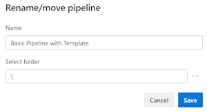

* Click `Save`

Our pipeline was now renamed and is now easier to find.

* Select the last run
* Select the job `Job`

You will now see the additional steps that are coming from our template:

* Docker pull image
* Docker run image with cowthink
* Docker run image with animal

Please have a deeper look into cowthink and animal. You will find some funny ASCII art in there.

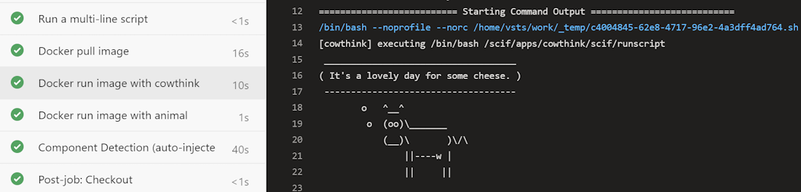

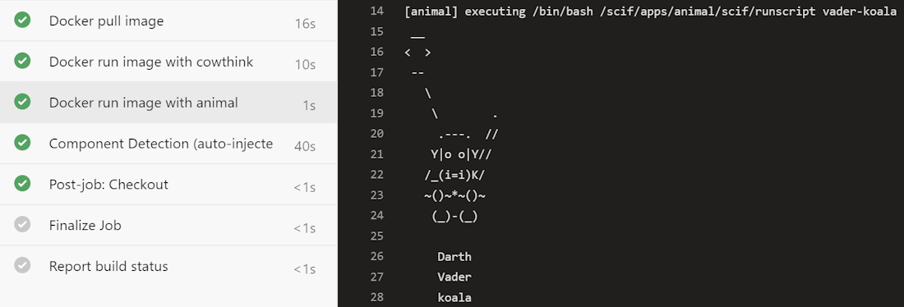

Besides the output itself you'll see here that there is no difference between pipeline coded loaded in the main YML and the code that's coming from templates.

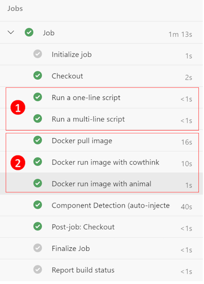

1) Is the part in our main pipeline file.
2) Are the steps coming from the template.

<!-- ------------------------------------------------------------------------------------------ -->
---

## Exercise 3.2: Reusing Templates in Different Stages

In the next task we are now going to build a slightly more advanced pipeline with multiple stages using the same template.

* Goto Pipelines -> Pipelines
* Click `New pipeline` (top right)
* Select `Azure Repos Git (YAML)`
* Select your repository
* Click `Starter pipeline`

This will create a new `Starter pipeline` in our repository. Replace the code with the following:

```yml
trigger: none

pool:
  vmImage: 'ubuntu-22.04'

stages:
- stage: linux
  displayName: 'Build Stage Linux'
  dependsOn: []

- stage: windows
  displayName: 'Build Stage Windows'
  dependsOn: []
```

Change the file name to be multi-stage-pipeline.yml.
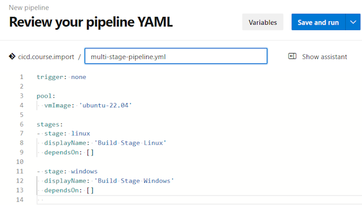

In its current state the pipeline contains only structure and no useful tasks. To change that we are now going to add code to load a template in each of our stages.

Extend the 'linux' stage with the following code:

```yml
  jobs:
  - template: /.azdo/pipelines/templates/multistage-jobs-template.yml
    parameters:
      name: 'Linux'
      pool:
        vmImage: 'ubuntu-22.04'
```

And the 'windows' stage with this:

```yml
  jobs:
  - template: /.azdo/pipelines/templates/multistage-jobs-template.yml
    parameters:
      name: 'Windows'
      pool:
        vmImage: 'vs2017-win2016'
```

Your pipeline should now look like this:

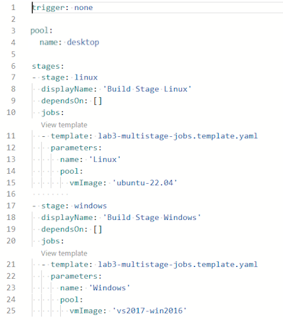

* Click `Save and run`
* Select `Create a new branch for this commit`
* Call it `lab3.2`
* Click `Save and run`

The pipeline should now start to run and you will see two stages (Build Stage Linux and Build Stage Windows) that use exactly the same template with different parameters:

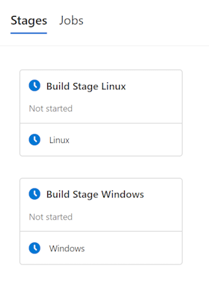

**Build Stage Linux** is downloading and executing a Docker container image on a Linux-based Build Agent, **Build Stage Windows** is doing exactly the same on a Windows-based one. This is a simple example but can be used for example to test specific things on different platforms.

> **Note!** Our pipeline is expected to fail as the container image we are using will not work on our Windows-based Build Agent. We'll address that in the next task of our lab.

<!-- ------------------------------------------------------------------------------------------ -->
---

## Exercise 3.3: Conditions

What we saw in the previous task is, that it might be sometimes required to not run all steps within a pipeline or its templates in every stage. Sometimes we need more logic and flexibility.

But how can we control that? This is where conditions come to play.

Conditions can be applied to stages, jobs and individual tasks. Let's now add a condition that our build task is only executed when the build agent runs on linux.

* Goto Pipelines -> Pipelines
* Select the pipeline from the previous task

Before we proceed let us give it a better name.

* Click on the following button:


* Select `Rename/move`
* Call it `Multi-stage pipeline with conditions`

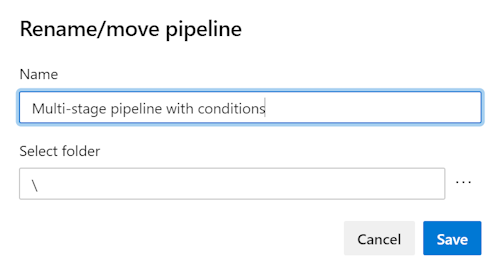

* Click `Save`

> Now that our pipeline was renamed let's proceed with editing it.

* Click `Edit`

In our editor we can see that we can only modify the pipeline itself but not it's templates. To edit them we've to go to our repository and modify the files directly.

But before we proceed to our template, let's take a deeper look into the pipeline editor and what we can see here:

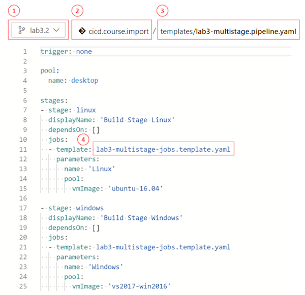

1) Shows us the branch we are working in here its **lab3.2**
2) Is our repository **MyDevOpsProject**
3) Is the path to our pipeline file in our repository
4) Is the name of our template file we want to modify next

> The template uses a relative path from the position of our pipeline file. In our case it's stored in the same folder in our repository.

Let's start..

* Goto Repos > Files
* Make sure that you're in the right repository and branch
* Goto `templates`
* Click on `multistage-jobs-template.yml`
* Click on Edit

We now want to modify the following task in our template:

```yml
  - script: docker run vanessa/cowsay run cowthink
```

This is the command that failed in our first run. We now want this task only to run in the linux stage. Not in the windows stage.

To achieve this we're going to add a condition (and a display name for the task to make it easier to identify it).

```yml
  - script: |
      docker run vanessa/cowsay run cowthink
    displayName: 'Docker run command'
    condition: eq(variables['System.StageName'], 'linux')
```

> If you're looking for a specific builtin or predefined variable, please have a look on the list of [predefined variables](https://docs.microsoft.com/azure/devops/pipelines/build/variables?view=azure-devops&tabs=yaml#pipeline-variables) on docs.microsoft.com.

* Click on `Commit`
* Save our changes to the `lab3.2` branch
* Click on `Commit` again

* Go back to Pipelines -> Pipelines
* Select our `Multi-stage pipeline with conditions`
* Click on `Run pipeline`
* Make sure that the correct branch (3.2) is selected
* Click on **Build Stage Windows**

Note! There are chances that your job is still queued, during this time keep calm :)

In the job details you'll now see that our stage that previously failed is now not executed as part of the windows stage anymore. Our condition works.

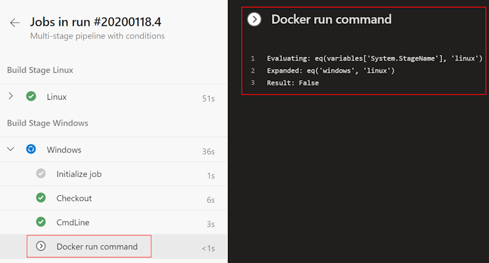

<!-- ------------------------------------------------------------------------------------------ -->
---

## Exercise 3.4: Skipping Stages

Sometimes it might be required to run only a subset of all stages within a pipeline. To achieve this, it's not needed to modify the pipeline itself. As part of the manual pipeline execution you can specify which stages should be executed.

* Goto Pipelines -> Pipelines
* Click on our `Multi-stage pipeline with conditions`
* Click on `Run pipeline`


This will open the `Run pipeline` dialog

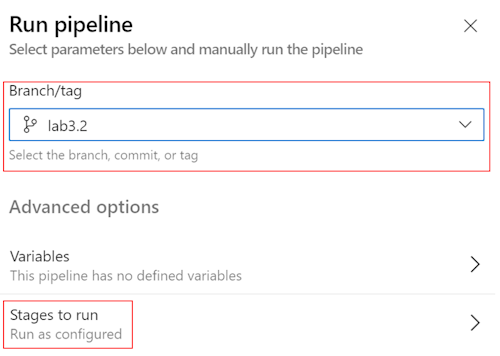

And here, in the `Run pipeline` dialog there's an option to modify the `Stages to run`.

* Make sure that the right branch is selected
* Click on `Stages to run`

In the next dialog you can now see all stages and you've the option to check or uncheck them to select if they'll be executed or skipped.

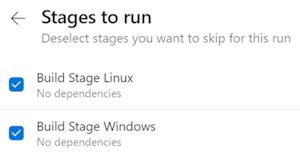

Let's now try to skip the `Build Stage Windows` stage.

* Un-check the stage `Build Stage Windows`

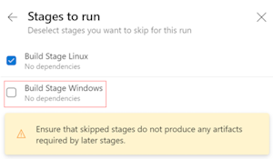

* Click on `Use selected stages`

The next dialog will now show you all selected stages (in our case only one):

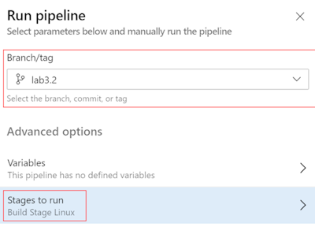

* Click on `Run` to start the pipeline

The pipeline job details will now show us that the previously unchecked pipeline step `Build Stage Windows` wasn't executed. It was skipped:

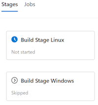

<!-- ------------------------------------------------------------------------------------------ -->
---

This completes Lab 3.

[Next Lab](../lab4/lab4.md) | [Previous Lab](../lab2/lab2.md) | [Table of Contents](/README.md)
