# Lab 5 - More Fun with Variables and Parameters

In this lab we are going to have more fun with variables and parameters.

Exercises:

* [5.1 Using Parameters](#exercise-51-using-parameters)
* [5.2 Local Variables](#exercise-52-local-variables)
* [5.3 Variable Template Files](#exercise-53-variable-template-files)
* [5.4 Predefined Variables](#exercise-54-predefined-variables)
* [5.5 Creating Variables in Code](#exercise-55-creating-variables-in-code)
* [5.6 Using Variable Groups](#exercise-56-using-variable-groups)
* [5.7 Loading Values from Key Vault](#exercise-57-loading-values-from-key-vault)
* [5.8 Verbose Logs](#exercise-58-verbose-logs)

<!-- ------------------------------------------------------------------------------------------ -->
---

## Exercise 5.1: Using Parameters

Input parameters are a way to provide values to your templates at runtime. You can use parameters to specify values that are not known until the time the template is deployed. Parameters make your templates more flexible and reusable.

Parameters can have default values, and you can specify the values for the parameters when you run the template. You can also specify a limited set of data types that are allowed for the parameter values. To view all of the available types, go to [https://learn.microsoft.com/en-us/azure/devops/pipelines/process/runtime-parameters](https://learn.microsoft.com/en-us/azure/devops/pipelines/process/runtime-parameters).

Let's create a new pipeline with some parameters:

* Goto Pipelines -> Pipelines
* Click `New pipeline`
* Select `Azure Repos Git (YAML)`
* Select our repository
* Click `Starter pipeline`
* Click on the filename and rename it to `pipeline-with-parameters.yml`

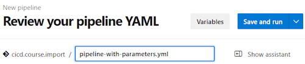

Let's add some parameters to our pipeline - paste the following code after the pools section:

```yml
parameters:
  - name: userName
    displayName: User Name
    type: string
    default: myname
  - name: adminUser
    displayName: Is this an Admin?
    type: boolean
    default: false
  - name: userLocation
    displayName: User Location
    type: string
    values:
      - US
      - Europe
      - Canada
    default: US
```

To show the values that the user selected at runtime, we can add the following line to the end of our pipeline:

Change the `echo Hello, world` section to look like this:

```yml
- script: echo Hello, ${{ parameters.userName }}!
  displayName: 'Welcome User'
```

You can also use parameters to conditionally execute tasks. For example, you can use the `condition` keyword to run a task only if a parameter is set to a specific value, or you can use an `{{ if ... }}` expression to run (or exclude) a task based on the value of a parameter.

Add these conditional tasks to the end of the pipeline:

```yml
- ${{ if eq(parameters.adminUser, 'true') }}:
  - script: echo ${{ parameters.userName }} will be added to the ${{ parameters.userLocation }} admins group!
    displayName: 'Create Admin User'
- ${{ else }}:
  - script: echo ${{ parameters.userName }} will be added to the ${{ parameters.userLocation }} basic users group!
    displayName: 'Create Basic User'
```

Click on `Save and run` to run the pipeline.
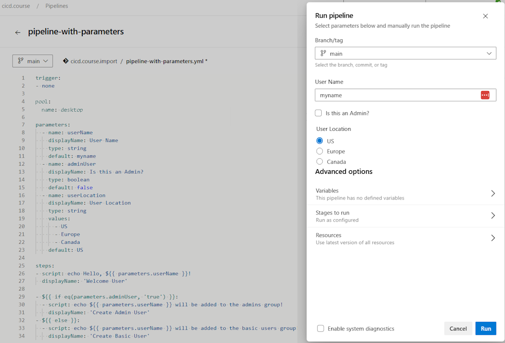

This is the output when run with a Basic User named `johndoe` in the `US` location:
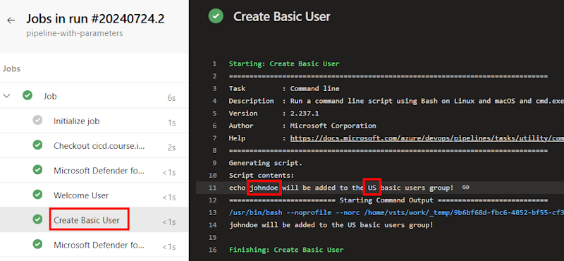

This is the output when the same job run with an Admin User named `myName` in the `Europe` location:
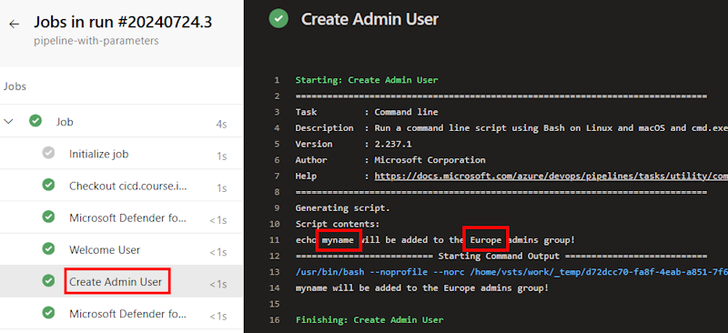

With these tools, you can prompt users to provide information and make choices about what sections should be run (or not).  For example, you could allow the user to skip steps that are not always needed to speed up a compile, like unit tests or scans. (Although that may seem like a not so great idea, you can require those steps to be run when checking into the main branch!)

<!-- ------------------------------------------------------------------------------------------ -->
---

## Exercise 5.2: Local Variables

You can also create local variables in your pipeline, which are a combination of predefined variables and user-defined values. Local variables are defined in the `variables` section of the pipeline and can be used throughout the pipeline.

There are many predefined variables (which can be found at [https://learn.microsoft.com/en-us/azure/devops/pipelines/build/variables](https://learn.microsoft.com/en-us/azure/devops/pipelines/build/variables)), that you can use to find the directory path for source files, what type of build agent you are using, what the build number is, etc.

Create a new pipeline (or you can keep reusing an adding to your previous one...).  Replace your pipeline this with this code which create a variable for the full directory path to the location of template files, then uses it to show the contents of the folder:

```yml
trigger:
- none
pool:
  name: desktop   # using custom build agent - or - vmImage: 'ubuntu-latest'  # if using Microsoft-hosted agent
variables:
  - name: templatePath
    value: '$(Build.SourcesDirectory)/.azdo/pipelines/templates'
steps:
- task: CmdLine@2
  displayName: List Template Directory
  inputs:
    script: |
        echo "Directory of $(templatePath):"
        tree -L 4 $(templatePath)
```

This is the output showing all of the template files:
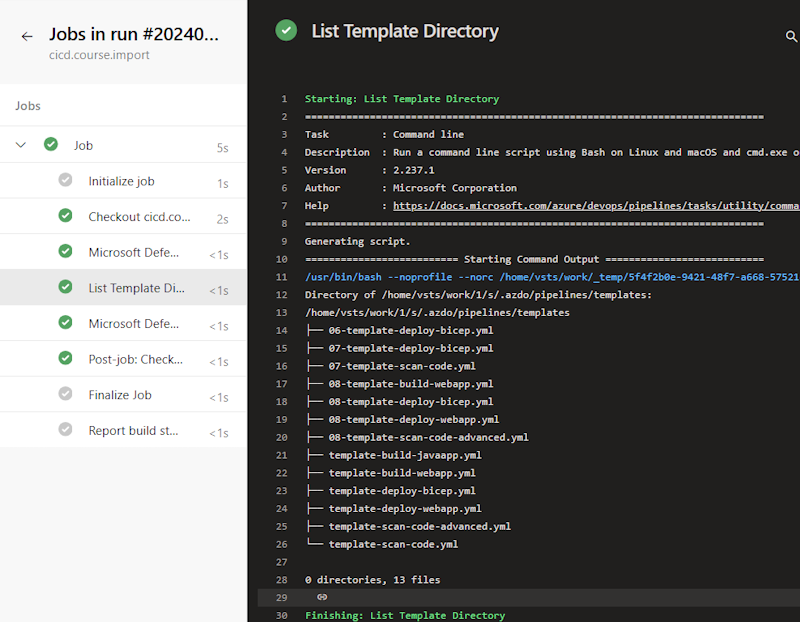

Note that this `tree -L 4` is a Linux command will show the first 4 levels of the directory structure.  You can change the number to see more or less of the directory structure. If you run on a Windows agent, you will need to use `dir /s` instead of `tree`.

<!-- ------------------------------------------------------------------------------------------ -->
---

## Exercise 5.3: Variable Template Files

Templates can also be stored in a separate file and referenced in the pipeline. This is useful when you have a task like a build template that you want to reuse, but the file and folder names might change from project to project.

Create a new file that contains project level variables to include in your pipeline called `project-locations.yml`.

1. Go back to Repos > Files
1. Create a new folder named `vars` and then create a file in that folder called `project-locations.yml`

    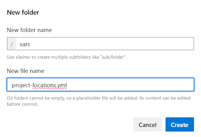

1. Paste in the following variables and save the file.

```yml
variables:
  - name: appFolderName
    value: 'src/MyApp'
  - name: appSolutionName
    value: 'MyApp.Web'
  - name: appProjectName
    value: 'MyProject.Web'
  - name: testFolderName 
    value: 'src/MyApp/MyApp.Tests'
  - name: testProjectName
    value: 'MyApp.Tests'
```

Once again, create a new pipeline:

* Goto Pipelines -> Pipelines
* Click `New pipeline`
* Select `Azure Repos Git (YAML)`
* Select our repository
* Click `Starter pipeline`

Then replace the contents of the pipeline with this code that references your variable file and displays the values:

```yml
trigger:
- none
pool:
  name: desktop   # using custom build agent - or - vmImage: 'ubuntu-latest'  # if using Microsoft-hosted agent
variables:
  - template: /.azdo/pipelines/vars/project-locations.yml
  - name: projectFullName
    value: '$(appFolderName)/$(appProjectName).csproj'

steps:
- task: CmdLine@2
  displayName: Application Specific Variables
  inputs:
    script: |
      echo "appFolderName=$(appFolderName)"
      echo "appSolutionName=$(appSolutionName)"
      echo "appProjectName=$(appProjectName)"
      echo "projectFullName=$(projectFullName)"
      echo "testFolderName=$(testFolderName)"
      echo "testProjectName=$(testProjectName)"
```

Sample Output:

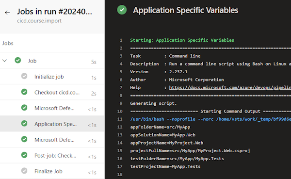

If you were using templates to do a build, you could use these values to build the proper files even if there were multiple projects in the same repository, as shown in this snippet:

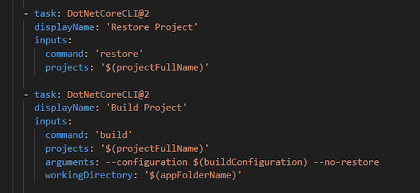

<!-- ------------------------------------------------------------------------------------------ -->
---

## Exercise 5.4: Predefined Variables

We've already used one of the [predefined variables](https://learn.microsoft.com/en-us/azure/devops/pipelines/build/variables) above to point to the source directory.  There are many others you can use - take a few minutes to look at the list and see if there are any that would be useful in your pipelines.

One thing that is easy to do is to name your pipelines uniquely.  You can use predefined variables to do this.  For example, you could use the following to name your pipeline with the date and the build number:

```yml
name: myapp-$(date:yyyy).$(date:MM).$(date:dd)$(rev:.r)
```

If you add that at the top of your pipeline, you will see that the name of the pipeline in the output queues will change to include the date (yyyy-mm-dd) along with a sequential number telling you how many times this pipeline has been run today.  This can be useful if you are running multiple pipelines and want to uniquely identify which run this came from.

Go ahead an add this at the top of one of your pipelines and run how the output changes.

<!-- ------------------------------------------------------------------------------------------ -->
---

## Exercise 5.5: Creating Variables in Code

You can also create variables in your pipeline code and pass them from step to step using the **task.setvariable** command.  You can also use the bash command to show ALL of the defined variables.  In the following example, we create a variable called `runDateTime` and then use it to create a JSON file with build information, and then used the `cat` command to display the contents of the file.

> **Note:** 'script:' is a shortcut for the 'CmdLine@2' task, and both the CmdLine and Bash tasks can be used to run bash commands. This example shows several ways to run bash commands in a pipeline, but they all do the same thing. You can also reference a script file in the 'script:' section if you have a lot of commands to run or something that you use across multiple pipelines.

Once again, create a new pipeline:

* Goto Pipelines -> Pipelines
* Click `New pipeline`
* Select `Azure Repos Git (YAML)`
* Select our repository
* Click `Starter pipeline`

Replace the contents of the pipeline with this code:

```yml
steps:
- task: Bash@3
  displayName: 'Create Variables'
  inputs: 
    targetType: 'inline'
    script: |
      runDateTime=$(echo $(date '+%Y%m%d-%H%M%S'))
      echo "##vso[task.setvariable variable=runDateTime]$runDateTime"
      echo "runDateTime=$runDateTime"

- task: Bash@3
  displayName: 'Display Variables'
  inputs:
    targetType: 'inline'
    script: 'env | sort'

- task: CmdLine@2
  displayName: "Put Build Details in buildinfo.json"
  inputs:
    script: |
      echo {"'buildDate'":"'$(runDateTime)'",\
        "'buildNumber'":"'$(Build.BuildNumber)'",\
        "'buildId'":"'$(Build.BuildId)'",\
        "'branchName'":"'$(Build.SourceBranchName)'",\
        "'commitHash'":"'$(Build.SourceVersion)'"} \
        > $(Build.SourcesDirectory)/buildinfo.json

- script: |
      echo "Build Info:"
      cat $(Build.SourcesDirectory)/buildinfo.json
  displayName: Show Build Info

```

Sample Output showing the BuildInfo file contents:

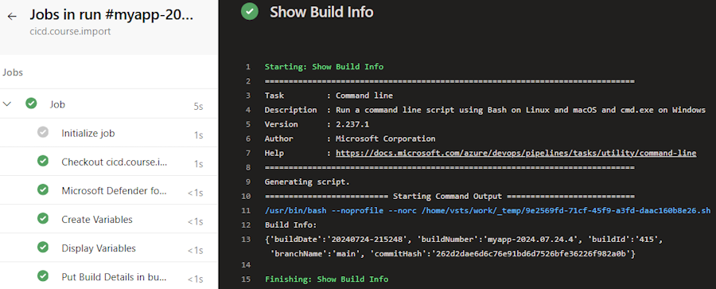

<!-- ------------------------------------------------------------------------------------------ -->
---

## Exercise 5.6: Using Variable Groups

Variable groups are a way to store values in Azure DevOps that you might want to pass into a YML pipeline or make available across multiple pipelines. You can share and use variable groups in multiple pipelines in the same project. To learn more, visit [https://learn.microsoft.com/en-us/azure/devops/pipelines/library/variable-groups](https://learn.microsoft.com/en-us/azure/devops/pipelines/library/variable-groups)

You can create variable group in the Azure DevOps UI, and adding variables to the group. If there are values that you want to remain secret, you can mark them as secrets by clicking the padlock and they will be encrypted. Note that once you do that, you will no longer be able to see the value of the secret. Pipelines will also respect this setting and will not display the value of the secret in the logs. For most secrets, it is preferred to store them in an Azure Key Vault and load them at runtime, but this is a good way to store non-secret values that you want to share across pipelines.

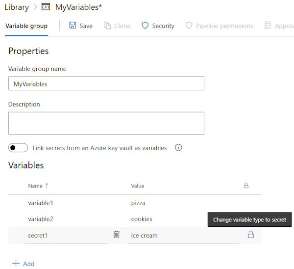

Go ahead and create a variable group  by navigating to Pipelines -> Library and clicking on `+ Variable group`, then add three variables and mark at least one of them as a secret.

To use a variable from a variable group, add a reference to the group in your YAML file, in the same way that we added a reference to the template file above in the variables section. You can then use the variables in the group in the same way that you use any other variable in your pipeline.

```yml
variables:
- group: myVariables
```

Once again, let's create a new pipeline:

* Goto Pipelines -> Pipelines
* Click `New pipeline`
* Select `Azure Repos Git (YAML)`
* Select our repository
* Click `Starter pipeline`

Insert these lines above the `steps:` section:

```yml
variables:
- group: myVariables
```

Then replace the contents of the the multi-line script with these lines:

```yml
- script: |
    echo "variable1=$(variable1)"
    echo "variable2=$(variable2)"
    echo "secret1=$(secret1)"
  displayName: 'Display Variables from Group'
```

It should look something like this:

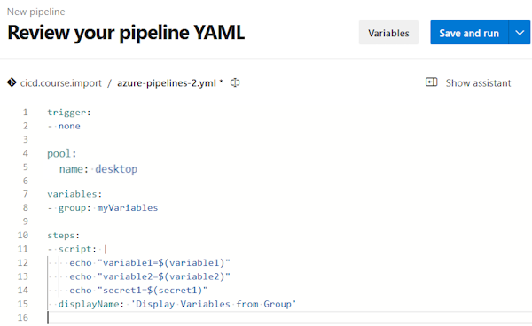

Save and Run the pipeline and you should see a prompt saying that you need to authorize the pipeline to use this variable group. Click on `View` and then `Permit` to allow the pipeline to use the variable group.

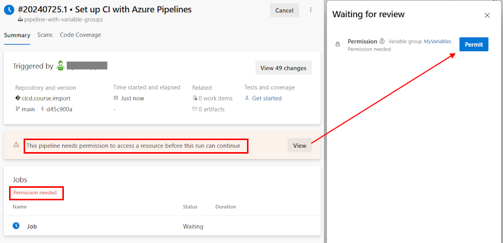

After granting this permission, you can see which pipelines have access to the variable group by clicking on the `Permissions` tab in the variable group.

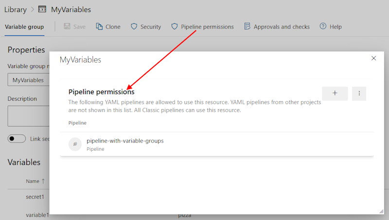

Sample Output:

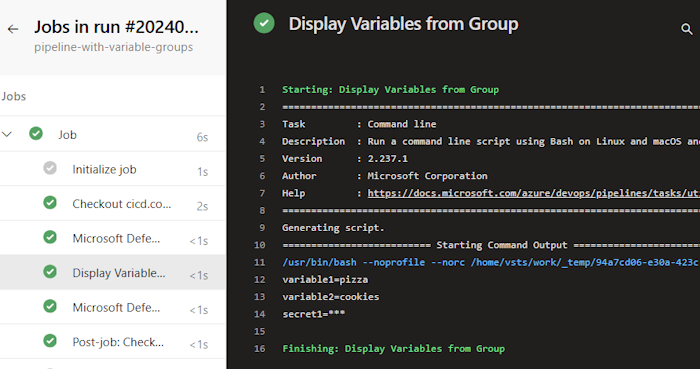

<!-- ------------------------------------------------------------------------------------------ -->
---

## Exercise 5.7: Loading Values from Key Vault

There are multiple ways to use secrets in your pipeline.  The best way is to use Azure Key Vault to store your secrets and then load them at runtime.  This is the most secure way to store secrets, as they are encrypted at rest and in transit.  And there are many ways to load secrets from Key Vault, including using the Azure DevOps UI, the Azure CLI, or the Azure DevOps REST API.

One easy approach is to use the Variable Groups feature in Azure DevOps to load secrets from Key Vault.  You can create a variable group and then link it to a Key Vault.  When you do this, the secrets in the Key Vault are loaded into the variable group and can be used in your pipelines. Values are not visible to users on the portal and they will not be shown in the logs.

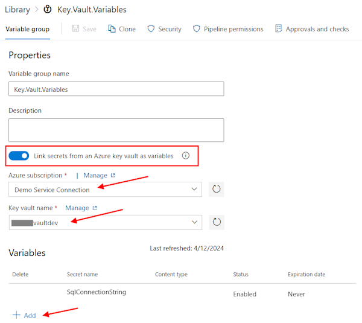

> **Note**: You cannot mix Key Vault and Non-Key Vault variables in the same group.  If you need to use both, you will need to create two separate groups and then include them both in your pipeline.

To use your new Key Vault, simply insert the group in the variables section of your pipeline, just like you did in the previous step.

```yml
variables:
- group: myVariables
- group: Key.Vault.Variables
```

We won't actually run this lab as it would involve having to create a Key Vault in Azure, but the variables work exactly the same as other variables.  You can try it on your own if you have access to an Azure subscription.

<!-- ------------------------------------------------------------------------------------------ -->
---

## Exercise 5.8: Verbose Logs

To assist with troubleshooting, you can configure your logs to be more verbose.  To configure verbose logs for a single run, you can start a new build by choosing Run pipeline and selecting Enable system diagnostics, Run.

Alternatively, you can add a variable named system.debug and set its value to true and that will do the same thing.

Azure pipeline logs can now capture resource utilization metrics such as memory, CPU usage and available disk space. The logs also include resources used by the pipeline agent and child processes including tasks run in a job. If you suspect your pipeline job may run into resource constraints, enable verbose logs to have resource utilization information injected into pipeline logs. Resource utilization metrics are available on any agent, independent from hosting model.

Select Verbose Mode:

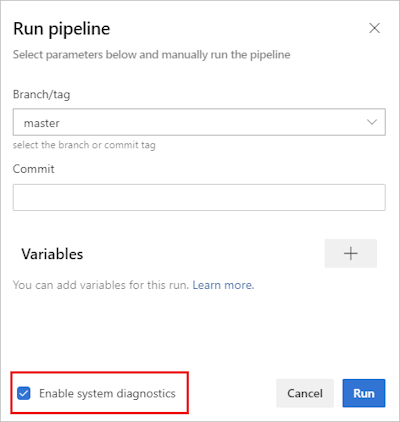

Example Output:

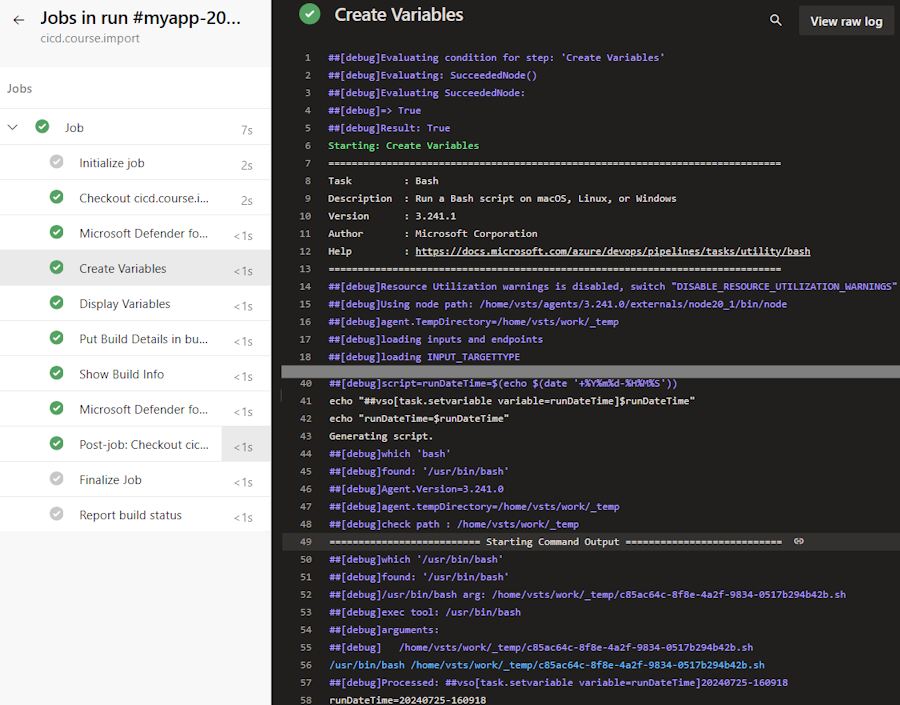

Go ahead and try this with one of our pipelines and explore the additional output that is generated.

<!-- ------------------------------------------------------------------------------------------ -->
---

This completes Lab 5.

[Next Lab](../lab6/lab6.md) | [Previous Lab](../lab4/lab4.md) | [Table of Contents](/README.md)
