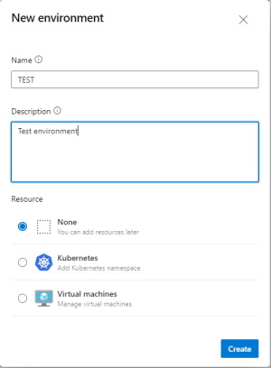

# Lab 6 - Multiple Environments and Stages

In this lab we are going to learn how to deploy to multiple environments using stages in Azure DevOps.

Exercises:

* [6.1 Creating AzDO Environments](#exercise-61-creating-azdo-environments)
* [6.2 Deploying to Multiple Environments with Dependencies](#exercise-62-deploying-to-multiple-environments-with-dependencies)

<!-- ------------------------------------------------------------------------------------------ -->
---

## Exercise 6.1: Creating AzDO Environments

For multi-stage deployments (i.e. DEV/QA/PROD), a DevOps Environment should be set up for each stage that that is being published. On that Environment definition, the rules that are needed can set up, such as specific approvers that are needed to publish to that environment.

---

## Environment Setup

> **Note:** If you just specify an environment in your pipeline, it will be created automatically. However, if you want to add specific approvers to that environment, you can create it using the steps below.  If it's already created, you can just skip to step 3.

**Step 1:** Go to the project environments page and select New environment:


**Step 2:** Enter the name of the new environment:



**Step 3:** To add an approver for an environment, select that environment, click on the "More" ellipsis, and select "Approvals and checks"


**Step 4:** Click on the plus sign to add new checks:


**Step 5:** Select the "Approvals" check from the list:


**Step 6:** Add the authorized approvers to the list and click "Create":


---

The environment should be ready to use now! Any pipelines that use this environment will require the specified approvers to approve the deployment before the job can continue.

Go ahead and create a DEV/QA/PROD environment for your pipelines and put yourself as an approver for the QA and PROD environments.

<!-- ------------------------------------------------------------------------------------------ -->
---

## Exercise 6.2: Deploying to Multiple Environments with Dependencies

In this exercise, we will build a full pipeline that does a scan/build/deploy to multiple environments with dependencies between them.

Let's start with a fresh pipeline

* Goto Pipelines -> Pipelines
* Click `New pipeline`
* Select `Azure Repos Git (YAML)`
* Select our repository
* Click `Starter pipeline`
* Click on the filename and rename it to `scan-build-deploy.yml`

Replace the contents of the pipeline with this starter code that we've seen before in Lab 4 that scans our source.

```yml
trigger:
 - none

pool:
  vmImage: ubuntu-latest

variables:
  - template: /.azdo/pipelines/vars/bicep-locations.yml

stages:
- stage: ScanApplication
  displayName: Scan Application
  jobs:
  - template: /.azdo/pipelines/templates/scan-code-template.yml

```

### Build the Code

Let's add a build step to the pipeline.  This will build the application code that we scanned in the previous step.  Add this code after the ScanApplication stage.

```yml
- stage: BuildApplication
  displayName: Build Application
  dependsOn: ScanApplication
  jobs:
  - template: /.azdo/pipelines/templates/build-code-template.yml

```

### Create the Infrastructure

Once we have built the application, we will want to ensure that our application resources have been deployed in Azure. We will automate the deploy of the Azure resources using a Bicep template (which we will explore in much more detail in upcoming labs!)

For now, just know that Bicep is the best way that we can define and deploy Azure Infrastructure as Code (IaC).

Add this step that calls the deploy-bicep-template right after the BuildApplication step. Note that this has that step as a dependency, so it will not run until that step has completed successfully.  The Bicep variables are defined in the vars/bicep-locations.yml file which we added in a previous step.

```yml
- stage: BicepDeployDev
  displayName: Bicep Dev Deploy
  dependsOn: BuildApplication
  condition: succeeded('BuildApplication')
  jobs:
  - template: /.azdo/pipelines/templates/deploy-bicep-template.yml
    parameters:
      environmentName: 'DEV'
      bicepPath: $(bicepPath)
      bicepFile: $(bicepFileName)
      parameterFile: $(bicepParameterFileName)

```

### Deploy the Code to DEV

Once the infrastructure is deployed, we can deploy the application to the Azure Application.  This works the same whether you are deploying a Web App, Function App, or Docker Container App.  (In each case, you would have a unique template that would deploy that application properly.)

Add this step after the BicepDeployDev step with that step as a dependency.  Note the last line has a unique Environment, and the stage also has the environment name in the name, because you can't have multiple stages in your pipeline with the same name.

```yml
- stage: AppDeployDev
  displayName: App Dev Deploy
  dependsOn: BicepDeployDev
  condition: succeeded('BicepDeployDev')
  jobs:
  - template: /.azdo/pipelines/templates/deploy-app-template.yml
    parameters:
      environmentName: 'DEV'

```

### Deploy the Code to QA and PROD

Once you have the DEV environment working, you can add the QA and PROD environments, in exactly the same way as we did DEV.  The QA environment will depend on the DEV environment, and the PROD environment will depend on the QA environment. The only thing that changes is the stage name and the environment name and dependencies.  The code to build and deploy the application is exactly the same in all three environments because we are using the same template.

```yml
- stage: BicepDeployQA
  displayName: Bicep QA Deploy
  dependsOn: AppDeployDev
  condition: succeeded('AppDeployDev')
  jobs:
  - template: /.azdo/pipelines/templates/deploy-bicep-template.yml
    parameters:
      environmentName: 'QA'
      bicepPath: $(bicepPath)
      bicepFile: $(bicepFileName)
      parameterFile: $(bicepParameterFileName)

- stage: AppDeployQA
  displayName: App QA Deploy
  dependsOn: BicepDeployQA
  condition: succeeded('BicepDeployQA')
  jobs:
  - template: /.azdo/pipelines/templates/deploy-app-template.yml
    parameters:
      environmentName: 'QA'

- stage: BicepDeployProd
  displayName: Bicep Prod Deploy
  dependsOn: AppDeployQA
  condition: succeeded('AppDeployQA')
  jobs:
  - template: /.azdo/pipelines/templates/deploy-bicep-template.yml
    parameters:
      environmentName: 'Prod'
      bicepPath: $(bicepPath)
      bicepFile: $(bicepFileName)
      parameterFile: $(bicepParameterFileName)

- stage: AppDeployProd
  displayName: App Prod Deploy
  dependsOn: BicepDeployProd
  condition: succeeded('BicepDeployProd')
  jobs:
  - template: /.azdo/pipelines/templates/deploy-app-template.yml
    parameters:
      environmentName: 'Prod'

```

Click on `Save and run` to run the pipeline.

The scan job should run and work properly.  However, the first time that your pipeline tries to access an environment, it will ask you to approve the deployment.  You will need to approve the deployment to the DEV environment before the pipeline can continue. This provides a good safeguard to prevent unauthorized deployments to protected environments. Random developers should not have permissions to approve use of a PROD environment, for example. And if for some reason they did, the access would be logged in that environment.

> *Note that in the following image, I've wrapped the QA and PROD environment pictures, otherwise this image would be too large to fit on the page!*


Once you review and approve use of the environment, the pipeline will continue to the next stage and should continue up to the Bicep QA Deploy stage, where it will ask you to approve use of the QA environment, then it will ask for the registered approver to approve this QA deployment.

> **Note:** The environment approvals only happen ONE time. Once the pipeline has been authorized to use an environment, it should never ask again.  However, the stage approvals will happen every time the pipeline runs.

The registered approver will be notified via an email that looks like this:


When they click on `Review approval` they will see this screen.


And when they click `Review` they will see a screen like this:


Once they approve the deployment, it will continue on to the PROD environment, where it will you to approve use of the PROD environment, then ask for the registered PROD approver to approve that deployment.

<!-- ------------------------------------------------------------------------------------------ -->
---

This completes Lab 6.

[Next Lab](../lab7/lab7.md) | [Previous Lab](../lab5/lab5.md) | [Table of Contents](/README.md)
