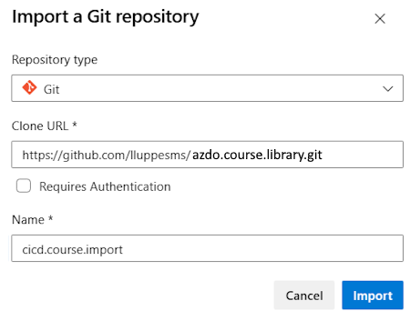
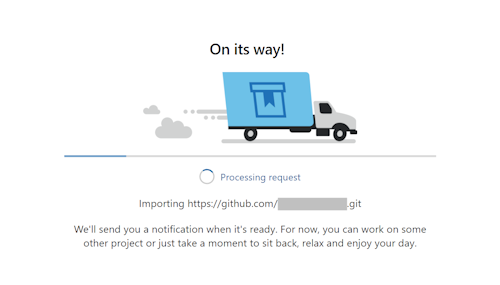
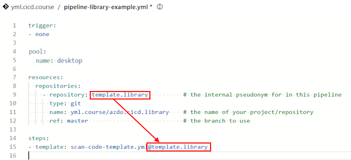
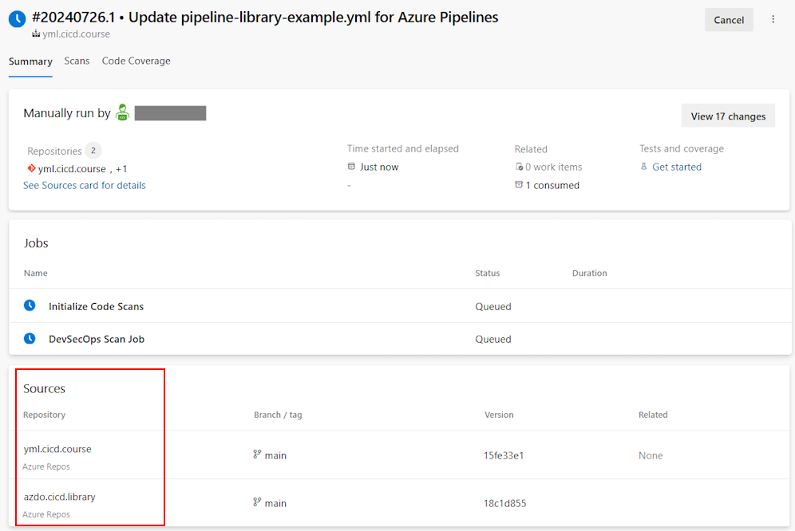

# Lab 7 - Reusable Libraries

In this lab we are going to learn how to create a central repository where you can have a library of shared YML templates that other projects can use

Exercises:

* [7.1 Creating a Template Repository](#71-creating-a-template-repository)

<!-- ------------------------------------------------------------------------------------------ -->
---

## 7.1 Creating a Template Repository

In this lab we will demonstrate how to create a central repository where you can have a library of shared YML templates that other projects can use. This is a common practice to ensure that all projects are using the same build and release definitions.  To do this, we will import an existing repository that contains some shared templates.

1. Navigate to **Repos** -> **Files** and select **Import a repository**

    

1. Import the Sample Templates Repository from GitHub:

    

    **Settings:**

    * Repository type: Git
    * Clone URL: `https://github.com/lluppesms/azdo.course.library.git`
    * Name: cicd.course

1. And click on "Import".

    

This will now import the sample template repository from GitHub into your Azure DevOps Repository.  We will use some of those templates in the following exercises.

<!-- ------------------------------------------------------------------------------------------ -->
---

## 7.2 Creating a Pipeline Using a Shared Library Template

Let's start by creating a new pipeline and then we will reference a shared template from the repository we just imported.

* Goto Pipelines -> Pipelines
* Click `New pipeline`
* Select `Azure Repos Git (YAML)`
* Select our repository
* Click `Starter pipeline`

This will now create new new `Starter pipeline` in our repository. Rename your pipeline file `pipeline-library-example.yml` by clicking on the filename and typing in that value.  Now that we have created a new pipeline and renamed it successfully, let's reference a template that contains our code scanning module by replacing the contents of the pipeline with this:

```yml
trigger:
- none

pool:
  vmImage: ubuntu-latest


stages:
  - template: templates/scan-code-template.yml@template.library

```

That looks great, but you are probably wondering where the `scan-code-template.yml` file is coming from. Notice the `@template.library` at the end of the template file name.  This is an alias that points to a repository where the file resides -- which we haven't defined yet.

A `pipeline resource` is anything used by a pipeline that exists outside the pipeline. After you define a resource, you can consume it anywhere in your pipeline. You can add other pipelines, repositories, builds, etc. In this case, we will create a `repository resource` that points to a library of templates that we can use in our pipelines.

> For more details on pipeline resources, see [Resources in YAML pipelines](https://learn.microsoft.com/en-us/azure/devops/pipelines/process/resources).

Let's define a repository resource by adding this code into the pipeline between the pool section and the steps sections:

```yml
resources:
  repositories:
    - repository: template.library        # the internal alias for the repo in this pipeline
      type: git
      name: yml.course/azdo.cicd.library  # the name of your project/repository
      ref: main                           # the branch to use

```

Your pipeline should now look like this:



After adding this line to the end of our new pipeline, save and run the pipeline.  

> (Note that since this is the first time this pipeline has run, and it references the environment 'DEV' in the template, you will need to approve the use of the 'DEV' environment.  Once you have approved the use of the environment, the pipeline should run successfully.)

When you look at the pipeline executing you should see multiple repositories that have been downloaded as part of the pipeline execution:



Our new pipeline looks and works exactly the same as the pipelines with templates that we did in previous labs, but now we are referencing templates in a library that we do not have to maintain, or that are maintained by a central team.

This is a great way to create consistent repeatable maintainable pipelines that can be used across your organization!

<!-- ------------------------------------------------------------------------------------------ -->
---

This completes Lab 7.

[Next Lab](../lab8/lab8.md) | [Previous Lab](../lab6/lab6.md) | [Table of Contents](../../README.md)
